# Introduction
This report details the development of an advanced Python-based interactive calculator application designed to perform basic arithmetic operations such as addition, subtraction, multiplication, and division, as well as some advanced operations (trigonometry/square/square root) through plugins. It maintains a history of calculations and allows the user to manage this history. The program implements a command line interface enabling the user to interact directly with the calculator. We have utilized Pandas to manage a robust calculation history to load, save, clear, and delete history records through the REPL interface and for efficient reading and writing to CSV file. A dynamic logging mechanism has been implemented through environment variables for log level and output of the log file. The program leverages design patterns and robust error handling to ensure a flexible and reliable user experience.

### Contributor: Deepthi Sachidanand

### [Calculator Demo Video](https://drive.google.com/file/d/1h3GMHbfaE_sQPTwAXCnnLAeCPZw2tF0_/view?usp=drive_link)

### Set up Instructions
1. Created a folder for midterm project and activated the virtual environment after navigating to the Project Directory ‘calc_pgm’.
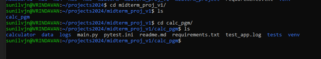
2. Created the requirements.txt file and installed the dependent libraries using pip (python-dotenv, pytest-pylint, pytest-cov, pandas. pip install -r requirements.txt
3. Added a .gitignore, .env, .pylintrc, .pytest.ini files to the project directory.
4. Configure the .env with the LOG_LEVEL and LOG_FILE parameters. 
5. Git hub Actions added to run the tests of the program. 
6. Logs and data folders created by code if not already existing.

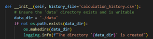
7. Execute the command “python main.py” to run the application. To run the tests, execute the command “pytest --pylint –cov”.
8. The directory structure of the project is below. The calculator folder has all the code implementation for the functionality – basic calculator operations, history management functions and menu option under operations folder, extended calculator operations provided by menu command under plugins folder. The tests folder has the test classes to ensure maximum test coverage and validate the basic operations, menu and history commands.
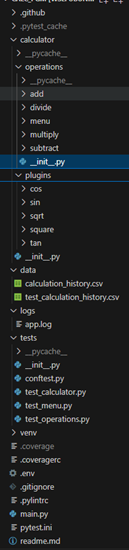			
9. Post successful testing with pytest, the code is added and committed to a new Git repository created for the midterm project. The code was committed in separate branches based on the completion of each feature. Master branch: Calculator operations with dynamic logging capability. History branch: Implemented the history management feature. Plugins feature: Added the menu command in REPL interface and provided options for extended calculations. The code from history and plugins branch was merged to the master branch after successful pytest execution. 

### Functionality and Usage Examples
1. Calculator Operations: The code in calculator/__init__.py provides the user to choose from the available options to perform basic calculator functions, pick the menu command or perform history management operations (load, save, clear, delete history). Based on the chosen operation, the corresponding code in calculator/operations/__init__.py is executed. The execute method for each of the Basic calculator operations: add, subtract, multiply, divide will be invoked to provide the result of the operation. This code is present in the corresponding command class. If the user picks the menu option, execute in MenuCommand class is invoked which in turn provides the user the ability to pick the plugin commands for cos, sin, tan, square and sqrt. The plugin commands could be found here. 
  - Code:	
	 - [App](https://github.com/deepthisanand2024/is601MidTerm-summer2024/blob/master/calculator/__init__.py)
	 - [Command](https://github.com/deepthisanand2024/is601MidTerm-summer2024/blob/master/calculator/operations/__init__.py)
	 - [Basic calculator command class](https://github.com/deepthisanand2024/is601MidTerm-summer2024/tree/master/calculator/operations)
	 - [Menu Command](https://github.com/deepthisanand2024/is601MidTerm-summer2024/blob/master/calculator/operations/menu/__init__.py)
	 - [Plugin commands](https://github.com/deepthisanand2024/is601MidTerm-summer2024/tree/master/calculator/plugins)

2. History Management: calculator/operations/__init__.py comprises of the HistoryManager class encapsulating the functions to load, save, clear and delete history using pandas. The class checks for the data directory and creates the calculation_history.csv file. This file will be used to read and write the calculation history. The add and save methods would add the calculation record to the dataframe and write to the file. The load method would read from the file and display to the user. The clear method would clear the history from the CSV file and the delete method would delete the record from the file based on the record number entered by the user.
  - Code:
        - [HistoryManager](https://github.com/deepthisanand2024/is601MidTerm-summer2024/blob/master/calculator/operations/__init__.py)
        - [calculation_history.csv file](https://github.com/deepthisanand2024/is601MidTerm-summer2024/blob/master/data/calculation_history.csv)

3. Logging Configuration via Environment Variables: Environment variables are used to configure logging levels and output destinations dynamically. The application reads these variables during initialization to set up logging appropriately. The application uses Python's logging module to record events that happen during the execution. Logging is configured using environment variables to allow flexibility in different environments (development, testing, production). 
   - Code/File: 
	- Methods to load the environment variables and logging is present in [App class](https://github.com/deepthisanand2024/is601MidTerm-summer2024/blob/master/calculator/__init__.py)
	- Configure [env file](https://github.com/deepthisanand2024/is601MidTerm-summer2024/blob/master/.env)
        - [Logs](https://github.com/deepthisanand2024/is601MidTerm-summer2024/tree/master/logs)
	
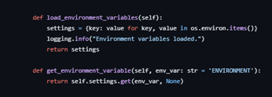

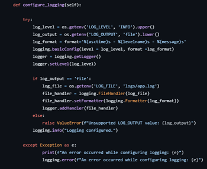

The application logs capture key events and error messages using the INFO and ERROR log levels in the log file. Example of the logs captured:
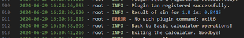

4. The Command Handler/REPL interface provide a menu to interact with the user, list available commands, and execute them.
   - Code: 
	- [App](https://github.com/deepthisanand2024/is601MidTerm-summer2024/blob/master/calculator/__init__.py)

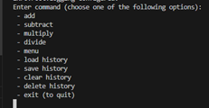

### Design Patterns
This section explains the implementation of several design patterns within the program: Facade Pattern, Command Pattern, Factory Method, Singleton, and Strategy Pattern. 
1. Facade Pattern provides a simplified interface to a complex subsystem. In the Calculator program, the App class serves as a Facade for the various components of the system, including command handling, history management, and plugin management. The App class initializes the system, configures logging, and provides methods to start the REPL, handle commands, and manage history. It hides the complexity of these subsystems from the user.
  	- Code:
  	- [App class](https://github.com/deepthisanand2024/is601MidTerm-summer2024/blob/master/calculator/__init__.py)

2. Command Pattern is used to encapsulate a request as an object, thereby allowing for parameterization of clients with queues, requests, and operations. In this program, different arithmetic operations are encapsulated as command objects.
  	- Code:
	- [Command](https://github.com/deepthisanand2024/is601MidTerm-summer2024/blob/master/calculator/operations/__init__.py): The Command class defines an interface for executing an operation.
	- Concrete Commands: Classes such as [AddCommand](https://github.com/deepthisanand2024/is601MidTerm-summer2024/blob/master/calculator/operations/add/__init__.py), [SubtractCommand](https://github.com/deepthisanand2024/is601MidTerm-summer2024/blob/master/calculator/operations/subtract/__init__.py), [MultiplyCommand](https://github.com/deepthisanand2024/is601MidTerm-summer2024/blob/master/calculator/operations/multiply/__init__.py), [DivideCommand](https://github.com/deepthisanand2024/is601MidTerm-summer2024/blob/master/calculator/operations/divide/__init__.py) implement the Command interface.
	- [CommandHandler](https://github.com/deepthisanand2024/is601MidTerm-summer2024/blob/master/calculator/operations/__init__.py): This class registers and executes commands.

3. Factory Method Pattern defines an interface for creating an object but allows subclasses to alter the type of objects that will be created. This pattern is useful in the Menu class where different plugin commands are instantiated. Plugin Commands: Each plugin command can be instantiated through a method call, encapsulating the creation logic. 
   	- Code:  
	- [Plugin commands](https://github.com/deepthisanand2024/is601MidTerm-summer2024/tree/master/calculator/plugins)
	- [MenuCommand](https://github.com/deepthisanand2024/is601MidTerm-summer2024/blob/master/calculator/operations/menu/__init__.py)

4. Singleton Pattern ensures a class has only one instance and provides a global point of access to it. This pattern is used in the Command Handler and History Manager class to ensure that only one history manager exists throughout the application.
  	- Code:
	- [CommandHandler and HistoryManager](https://github.com/deepthisanand2024/is601MidTerm-summer2024/blob/master/calculator/operations/__init__.py)

The Calculator program effectively implements these design patterns to create a flexible, maintainable, and extensible application. The Facade Pattern simplifies interactions with the system, the Command Pattern encapsulates operations, the Factory Method handles dynamic object creation, the Singleton Pattern ensures a single instance of critical classes.

### Error Handling

Error handling is a critical aspect of robust software design. In the Calculator program, error handling is implemented using two primary approaches: "Look Before You Leap" (LBYL) and "Easier to Ask for Forgiveness than Permission" (EAFP). This section provides a detailed explanation of these approaches and examples of their implementation in the program. 
	1. *LBYL approach*  involves checking conditions before performing an operation to avoid errors. This proactive strategy ensures that all prerequisites are met before proceeding, thereby preventing exceptions from being raised. It is particularly useful when conditions are easy to check and the cost of doing so is low.
     - Implementation Examples:
	Checking Index Validity: When deleting a history record, the program checks if the provided index is valid before attempting the deletion. In this example, the program checks if the index is less than 0 before proceeding with the deletion. This prevents an invalid operation and avoids raising an exception.

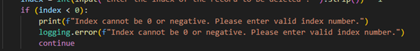
	Checking for Unknown commands: The program checks if the commands entered by the user are from the list of available options in the REPL interface. If the command does not match with these options, the program logs an error exits out. This prevents an invalid operation due to unknown user commands.

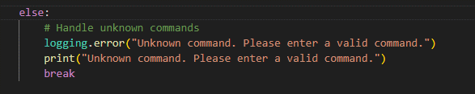
	2.  *EAFP approach*  involves trying to perform an operation directly and catching exceptions if they occur. This reactive strategy is useful when it is difficult or costly to check conditions beforehand, or when multiple conditions need to be checked simultaneously. 
	- Implementation Examples:
	Handling Non-Existent History File: When loading history, the program attempts to read the file and catches a FileNotFoundError if the file does not exist. In this example, the program attempts to load the history file without checking its existence first. If the file is not found, it catches the FileNotFoundError and logs an error.

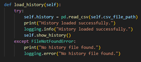
	 Executing Plugin Commands: When executing plugin commands, the program tries to execute the command and catches a KeyError if the command is not found. In this example, the program attempts to execute a command from the plugin_commands dictionary. If the command does not exist, it catches the KeyError and logs an error.

These approaches ensure that the program is robust and can handle unexpected situations gracefully, providing a better user experience and maintaining the integrity of the application's functionality.

### Testing
In the Calculator program, we used pytest as our testing framework to validate the functionality of various components. Test files are placed in the  tests directory. We have 3 test files to cover various components, including command handling, history management, and plugin management. The coverage report shows 100% coverage. Using pytest for testing and coverage for measuring test coverage provides a robust framework for ensuring the reliability and correctness of the Calculator program. High test coverage ensures that most of the codebase is exercised, helping to catch potential bugs and maintain code quality.

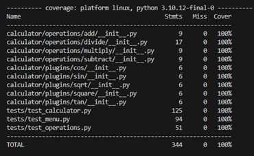

### Conclusion
This report provided an overview of the setup, functionality, design patterns, error handling, and testing strategy for the Calculator program. By leveraging pytest for testing and ensuring high test coverage, the application achieves robustness and reliability, offering a flexible and maintainable solution for various arithmetic operations.

The Calculator program effectively utilizes several design patterns to create a modular and extensible architecture:
	• Facade Pattern simplifies interactions with the system by providing a unified interface.
	• Command Pattern encapsulates different operations as command objects, making it easier to manage and extend functionalities.
	• Factory Method allows for dynamic creation of plugin commands, enhancing the flexibility of the application.
	• Singleton Pattern ensures that only one instance of the HistoryManager class exists, maintaining a consistent state throughout the application.

Additionally, the application implements robust error handling using both LBYL and EAFP approaches to gracefully handle unexpected situations and maintain the integrity of the application's functionality.

The integration of environment variables for dynamic logging configuration adds to the flexibility, allowing the application to adapt to different environments seamlessly.

Overall, the Calculator program is a comprehensive example of how to build a robust, flexible, and maintainable application using advanced programming techniques and design patterns.

